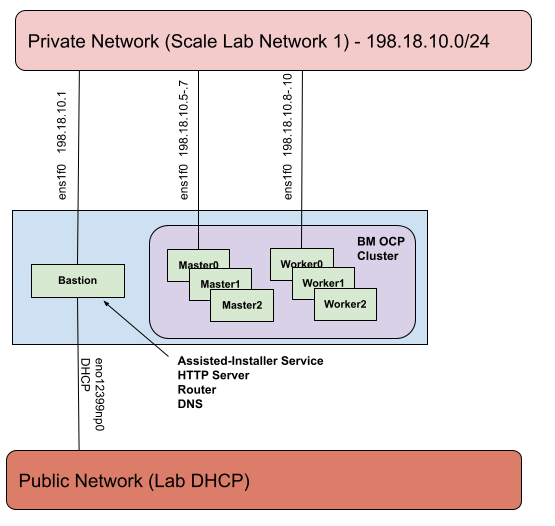

# Deploy a Bare Metal cluster via Jetlag from an Alias (perf) Lab Bastion Machine quickstart

Assuming you received an alias lab allocation named `cloud99`, this guide will walk you through getting a bare-metal cluster up in your allocation. For purposes of the guide the systems in `cloud99` will be Dell r650s. You should run Jetlag directly on the bastion machine. Jetlag picks the first machine in an allocation as the bastion. You can [trick Jetlag into picking a different machine as the bastion](tips-and-vars.md#override-lab-ocpinventory-json-file) but that is beyond the scope of this quickstart. You can find the machines in your cloud allocation on
[the alias lab wiki](http://wiki.rdu3.labs.perfscale.redhat.com/)

_**Table of Contents**_

<!-- TOC -->
- [Bastion setup](#bastion-setup)
- [Configure Ansible vars in `all.yml`](#configure-ansible-vars-in-allyml)
- [Review vars all.yml](#review-vars-allyml)
- [Run playbooks](#run-playbooks)
- [Monitor install and interact with cluster](#monitor-install-and-interact-with-cluster)
<!-- /TOC -->

<!-- Bastion setup is duplicated in multiple files and should be kept in sync!
     - deploy-bm-alias.md
     - deploy-bm-byol.md
     - deploy-bm-ibmcloud.md
     - deploy-bm-scale.md
     - deploy-sno-alias.md
     - deploy-sno-ibmcloud.md
     - deploy-sno-scale.md
 -->
## Bastion setup

1. Select the bastion machine from the allocation. You should run Jetlag on the
bastion machine, to ensure full connectivity and fastest access. By convention
this is usually the first node of your allocation: for example, the first machine
listed in your cloud platform's standard inventory display.

2. You can copy your ssh public key to the designated bastion machine to make it easier to
repeatedly log in from your laptop:

```console
[user@<local> ~]$ ssh-copy-id root@<bastion>
/usr/bin/ssh-copy-id: INFO: attempting to log in with the new key(s), to filter out any that are already installed
/usr/bin/ssh-copy-id: INFO: 2 key(s) remain to be installed -- if you are prompted now it is to install the new keys
Warning: Permanently added '<bastion>,x.x.x.x' (ECDSA) to the list of known hosts.
root@<bastion>'s password:

Number of key(s) added: 2
```

Now log in to the bastion (with `ssh root@<bastion>` if you copied your public key above,
or using the bastion root account password if not), because the remaining commands
should be executed from the bastion.

3. Upgrade RHEL to at least RHEL 8.6

You need to be running at least RHEL 8.6 to have the minimal `podman`. By default,
the ALIAS lab installs RHEL 8.2. We recommend upgrading to RHEL 8.9
using the `/root/update-latest-rhel-release.sh` script provisioned by the QUADS
system. You can determine the installed version by looking at `/etc/redhat-release`,
and the update script allows you to ask what versions are available:

```console
[root@<bastion> ~]# cat /etc/redhat-release
Red Hat Enterprise Linux release 8.2 (Ootpa)
[root@<bastion> ~]# /root/update-latest-rhel-release.sh list`
8.2 8.6 8.9
```

```console
[root@<bastion> ~]# ./update-latest-rhel-release.sh 8.9
Changing repository from 8.2 to 8.9
Cleaning dnf repo cache..

-------------------------
Run dnf update to upgrade to RHEL 8.9

[root@<bastion> ~]# dnf update -y
Updating Subscription Management repositories.
Unable to read consumer identity
This system is not registered to Red Hat Subscription Management. You can use subscription-manager to register.
rhel89 AppStream                                                                                                                                              245 MB/s | 7.8 MB     00:00
rhel89 BaseOS                                                                                                                                                 119 MB/s | 2.4 MB     00:00
Extra Packages for Enterprise Linux 8 - x86_64                                                                                                                 14 MB/s |  14 MB     00:00
Last metadata expiration check: 0:00:01 ago on Tue 02 May 2023 06:58:15 PM UTC.
Dependencies resolved.
...
Complete!
[root@<bastion> ~]# reboot
Connection to <bastion> closed by remote host.
Connection to <bastion> closed.
...
[user@<local> ~]$ ssh root@<bastion>
...
[root@<bastion> ~]# cat /etc/redhat-release
Red Hat Enterprise Linux release 8.9 (Ootpa)
```

4. Install some additional tools to help after reboot

```console
[root@<bastion> ~]# dnf install tmux git python3-pip sshpass -y
Updating Subscription Management repositories.
...
Complete!
```

5. Setup ssh keys for the bastion root account and copy to itself to permit
local ansible interactions:

```console
[root@<bastion> ~]# ssh-keygen
Generating public/private rsa key pair.
Enter file in which to save the key (/root/.ssh/id_rsa):
Enter passphrase (empty for no passphrase):
Enter same passphrase again:
Your identification has been saved in /root/.ssh/id_rsa.
Your public key has been saved in /root/.ssh/id_rsa.pub.
The key fingerprint is:
SHA256:uA61+n0w3Dht4/oIy1IKXrSgt9tfC/8zjICd7LJ550s root@<bastion>
The key's randomart image is:
+---[RSA 3072]----+
...
+----[SHA256]-----+
[root@<bastion> ~]# ssh-copy-id root@localhost
/usr/bin/ssh-copy-id: INFO: Source of key(s) to be installed: "/root/.ssh/id_rsa.pub"
The authenticity of host 'localhost (127.0.0.1)' can't be established.
ECDSA key fingerprint is SHA256:fvvO3NLxT9FPcoOKQ9ldVdd4aQnwuGVPwa+V1+/c4T8.
Are you sure you want to continue connecting (yes/no/[fingerprint])? yes
/usr/bin/ssh-copy-id: INFO: attempting to log in with the new key(s), to filter out any that are already installed
/usr/bin/ssh-copy-id: INFO: 1 key(s) remain to be installed -- if you are prompted now it is to install the new keys
root@localhost's password:

Number of key(s) added: 1

Now try logging into the machine and check to make sure that only the key(s) you wanted were added:
```console
[root@<bastion> ~]# ssh root@localhost
[root@<bastion> ~]#
```

6. Clone the `jetlag` GitHub repo

```console
[root@<bastion> ~]# git clone https://github.com/redhat-performance/jetlag.git
Cloning into 'jetlag'...
remote: Enumerating objects: 4510, done.
remote: Counting objects: 100% (4510/4510), done.
remote: Compressing objects: 100% (1531/1531), done.
remote: Total 4510 (delta 2450), reused 4384 (delta 2380), pack-reused 0
Receiving objects: 100% (4510/4510), 831.98 KiB | 21.33 MiB/s, done.
Resolving deltas: 100% (2450/2450), done.
```

The `git clone` command will normally set the local head to the Jetlag repo's
`main` branch. To set your local head to a different branch or tag (for example,
a development branch), you can add `-b <name>` to the command.

Change your working directory to the repo's `jetlag` directory, which we'll assume
for subsequent steps:

```console
[root@<bastion> ~]# cd jetlag
[root@<bastion> jetlag]#
```

7. Download your `pull_secret.txt` from [console.redhat.com/openshift/downloads](https://console.redhat.com/openshift/downloads) into the root directory of your Jetlag repo on the bastion. You'll find the Pull Secret near the end of
the long downloads page, in the section labeled "Tokens". You can either click the "Download" button, and then copy the
downloaded file to `~/jetlag/pull_secret.txt` on the bastion (notice that Jetlag expects an underscore (`_`) while the
file will download with a hyphen (`-`)); *or* click on the "Copy" button, and then paste the clipboard into the terminal
after typing `cat >pull_secret.txt` on the bastion to create the expected filename:

```console
[root@<bastion> jetlag]# cat >pull_secret.txt
{
  "auths": {
    "quay.io": {
      "auth": "XXXXXXX",
      "email": "XXXXXXX"
    },
    "registry.connect.redhat.com": {
      "auth": "XXXXXXX",
      "email": "XXXXXXX"
    },
    "registry.redhat.io": {
      "auth": "XXXXXXX",
      "email": "XXXXXXX"
    }
  }
}
```

If you are deploying nightly builds then you will need to add a ci token and an entry for
`registry.ci.openshift.org`. If you plan on deploying an ACM downstream build be sure to
include an entry for `quay.io:443`.

8. Execute the bootstrap script in the current shell, with `source bootstrap.sh`.
This will activate a local virtual Python environment configured with the Jetlag and
Ansible dependencies.

```console
[root@<bastion> jetlag]# source bootstrap.sh
Collecting pip
...
(.ansible) [root@<bastion> jetlag]#
```

You can re-enter that virtual environment when you log in to the bastion again
with:

```console
[root@<bastion> ~]# cd jetlag
[root@<bastion> jetlag]# source .ansible/bin/activate
```

<!-- End of duplicated setup text -->

## Configure Ansible vars in `all.yml`

Copy the sample vars file and edit it:

```console
(.ansible) [root@xxx-h01-000-r650 jetlag]# cp ansible/vars/all.sample.yml ansible/vars/all.yml
(.ansible) [root@xxx-h01-000-r650 jetlag]# vi ansible/vars/all.yml
```

### Lab & cluster infrastructure vars

Change `lab` to `lab: alias`

Change `lab_cloud` to `lab_cloud: cloud99`

Change `cluster_type` to `cluster_type: bm`

Set `worker_node_count` to limit the number of worker nodes from your alias lab allocation. Set it to `0` if you want a 3 node compact cluster.

Set `ocp_build` to one of 'dev' (early candidate builds) or 'ga' for Generally Available versions of OpenShift. Empty value results in playbook failing with error message. Example of dev builds would be 'candidate-4.17', 'candidate-4.16 or 'latest' (which would point to the early candidate build of the latest in development release) and examples of 'ga' builds would  be explicit versions like '4.15.20' or '4.16.0' or you could also use things like latest-4.16 to point to the latest z-stream of 4.16. Checkout https://mirror.openshift.com/pub/openshift-v4/clients/ocp for a list of available builds for 'ga' releases and https://mirror.openshift.com/pub/openshift-v4/clients/ocp-dev-preview for a list of 'dev' releases.

Set `ocp_version` to the version of the openshift-installer binary, undefined or empty results in the playbook failing with error message. Values accepted depended on the build chosen ('ga' or 'dev'). For 'ga' builds some examples of what you can use are 'latest-4.13', 'latest-4.14' or explicit versions like 4.15.2 For 'dev' builds some examples of what you can use are 'candidate-4.16' or just 'latest'.

Only change `networktype` if you need to test something other than `OVNKubernetes`

### Bastion node vars

Set `smcipmitool_url` to the location of the Supermicro SMCIPMITool binary. Since you must accept a EULA in order to download, it is suggested to download the file and place it onto a local http server, that is accessible to your laptop or deployment machine. You can then always reference that URL. Alternatively, you can download it to the `ansible/` directory of your Jetlag repo clone and rename the file to `smcipmitool.tar.gz`. You can find the file [here](https://www.supermicro.com/SwDownload/SwSelect_Free.aspx?cat=IPMI).

The system type determines the values of `bastion_lab_interface` and `bastion_controlplane_interface`.

Using the chart provided by the [alias lab here](https://wiki.rdu3.labs.perfscale.redhat.com/usage/#Private_Networking), determine the names of the nic per network for EL8.

* `bastion_lab_interface` will always be set to the nic name under "Public Network"
* `bastion_controlplane_interface` should be set to the nic name under "EM1" for this guide

For Dell r750 set those vars to the following

```yaml
bastion_lab_interface: eno8303
bastion_controlplane_interface: ens3f0
```

Here you can see a network diagram for the bare metal cluster on Dell r650 with 3 workers and 3 master nodes:



Double check your nic names with your actual bastion machine.

** If you desire to use a *different network* than "Network 1" for your controlplane network then you will have to append additional overrides to the extra vars portion of the `all.yml` vars file.
See [tips and vars](tips-and-vars.md#using-other-network-interfaces) for more information

### OCP node vars

The same chart provided by the alias lab for the bastion machine, is used to identify the nic name for `controlplane_lab_interface`.

* `controlplane_lab_interface` should always be set to the nic name under "Public Network" for the specific system type

For Dell r750 set `controlplane_lab_interface` var to the following

```yaml
controlplane_lab_interface: eno8303
```

** If your machine types are not homogeneous, then you will have to manually edit your generated inventory file to correct any nic names until this is reasonably automated.

### Extra vars

For bare-metal deployment of OCP 4.13 or later, it's advisable to configure the following extra variables.
- control_plane_install_disk
- worker_install_disk

These variables ensure disk references are made using by-path notation instead of symbolic links. This approach is recommended due to potential reliability issues with symbolic links. The values mentioned [Review `all.yml`](#review-vars-allyml) are correct for the Scale lab R750 instances. Please refer to [tips and vars](tips-and-vars.md#extra-vars-for-by-path-disk-reference) to determine the correct paths for other instances.

### Disconnected and ipv6 vars

If you want to deploy a disconnected ipv6 cluster then the following vars need to be set.

Change `setup_bastion_registry` to `setup_bastion_registry: true` and `use_bastion_registry` to `use_bastion_registry: true` under "Bastion node vars"

Append the following "override" vars in "Extra vars"

```yaml
controlplane_network: fc00:1000::/64
controlplane_network_prefix: 64
cluster_network_cidr: fd01::/48
cluster_network_host_prefix: 64
service_network_cidr: fd02::/112
fix_metal3_provisioningosdownloadurl: true
```

Oddly enough if you run into any routing issues because of duplicate address detection, determine if someone else is using subnet `fc00:1000::/64` in the same lab environment and adjust accordingly.

The completed `all.yml` vars file and generated inventory files following this section only reflect that of an ipv4 connected install. If you previously deployed ipv4 stop and remove all running podman containers off the bastion and rerun the `setup-bastion.yml` playbook.

## Review vars `all.yml`

The `ansible/vars/all.yml` now resembles ..

```yaml
---
# Sample vars file
################################################################################
# Lab & cluster infrastructure vars
################################################################################
# Which lab to be deployed into (Ex alias)
lab: alias
# Which cloud in the lab environment (Ex cloud42)
lab_cloud: cloud99

# Either bm or rwn or sno
cluster_type: bm

# Applies to both bm/rwn clusters
worker_node_count: 0

# Lab Network type, applies to sno cluster_type only
# Set this variable if you want to host your SNO cluster on lab public routable
# VLAN network, set this ONLY if you have public routable VLAN enabled in your
# alias cloud
public_vlan: false

# Enter whether the build should use 'dev' (early candidate builds) or 'ga' for Generally Available versions of OpenShift
# Empty value results in playbook failing with error message. Example of dev builds would be 'candidate-4.17', 'candidate-4.16'
# or 'latest' (which would point to the early candidate build of the latest in development release) and examples of 'ga' builds would
# be explicit versions like '4.15.20' or '4.16.0' or you could also use things like latest-4.16 to point to the latest z-stream of 4.16.
# Checkout https://mirror.openshift.com/pub/openshift-v4/clients/ocp for a list of available builds for 'ga' releases and
# https://mirror.openshift.com/pub/openshift-v4/clients/ocp-dev-preview for a list of 'dev' releases.
ocp_build: "ga"

# The version of the openshift-installer binary, undefined or empty results in the playbook failing with error message.
# Values accepted depended on the build chosen ('ga' or 'dev').
# For 'ga' builds some examples of what you can use are 'latest-4.13', 'latest-4.14' or explicit versions like 4.15.2
# For 'dev' builds some examples of what you can use are 'candidate-4.16' or just 'latest'
ocp_version: "latest-4.15"

# Either "OVNKubernetes" or "OpenShiftSDN" (Only for BM/RWN cluster types)
networktype: OVNKubernetes

ssh_private_key_file: ~/.ssh/id_rsa
ssh_public_key_file: ~/.ssh/id_rsa.pub
# Place your pull_secret.txt in the base directory of the cloned Jetlag repo, Example:
# [root@<bastion> jetlag]# ls pull_secret.txt
pull_secret: "{{ lookup('file', '../pull_secret.txt') }}"

################################################################################
# Bastion node vars
################################################################################
bastion_cluster_config_dir: /root/{{ cluster_type }}

smcipmitool_url:

bastion_lab_interface: eno8303
bastion_controlplane_interface: ens3f0

# vlaned interfaces are for remote worker node clusters only
bastion_vlaned_interface: ens1f1

# Sets up Gogs a self-hosted git service on the bastion
setup_bastion_gogs: false

# Set to enable and sync container images into a container image registry on the bastion
setup_bastion_registry: false

# Use in conjunction with ipv6 based clusters
use_bastion_registry: false

################################################################################
# OCP node vars
################################################################################
# Network configuration for all bm cluster and rwn control-plane nodes
controlplane_lab_interface: eno8303

# Network configuration for public VLAN based sno cluster_type deployment
controlplane_pub_network_cidr:
controlplane_pub_network_gateway:
jumbo_mtu: false

# Network only for remote worker nodes
rwn_lab_interface: eno1np0
rwn_network_interface: ens1f1

################################################################################
# Extra vars
################################################################################
# Append override vars below
control_plane_install_disk: /dev/disk/by-path/pci-0000:65:00.0-scsi-0:2:0:0
worker_install_disk: /dev/disk/by-path/pci-0000:65:00.0-scsi-0:2:0:0
```

## Run playbooks

Run the create inventory playbook

```console
(.ansible) [root@<bastion> jetlag]# ansible-playbook ansible/create-inventory.yml
...
```

The `create-inventory.yml` playbook will create an inventory file `ansible/inventory/cloud99.local` from the lab allocation data and the vars file.

The inventory file resembles ...

```
[all:vars]
allocation_node_count=16
supermicro_nodes=False

[bastion]
xxx-h01-000-r650.rdu3.lab.perflab.redhat.com ansible_ssh_user=root bmc_address=mgmt-xxx-h01-000-r650.rdu3.lab.perfscale.redhat.com

[bastion:vars]
bmc_user=quads
bmc_password=XXXXXXX

[controlplane]
xxx-h02-000-r650 bmc_address=mgmt-xxx-h02-000-r650.rdu3.lab.perfscale.redhat.com network_mac=b4:96:91:cb:ec:02 lab_mac=5c:6f:69:75:c0:70 ip=198.18.10.5 vendor=Dell install_disk=/dev/sda
xxx-h03-000-r650 bmc_address=mgmt-xxx-h03-000-r650.rdu3.lab.perfscale.redhat.com network_mac=b4:96:91:cc:e5:80 lab_mac=5c:6f:69:56:dd:c0 ip=198.18.10.6 vendor=Dell install_disk=/dev/sda
xxx-h05-000-r650 bmc_address=mgmt-xxx-h05-000-r650.rdu3.lab.perfscale.redhat.com network_mac=b4:96:91:cc:e6:40 lab_mac=5c:6f:69:56:b0:50 ip=198.18.10.7 vendor=Dell install_disk=/dev/sda

[controlplane:vars]
role=master
boot_iso=discovery.iso
bmc_user=quads
bmc_password=XXXXXXX
lab_interface=eno8303
network_interface=eth0
network_prefix=24
gateway=198.18.10.1
dns1=198.18.10.1

[worker]

[worker:vars]
role=worker
boot_iso=discovery.iso
bmc_user=quads
bmc_password=XXXXXXX
lab_interface=eno8303
network_interface=eth0
network_prefix=24
gateway=198.18.10.1
dns1=198.18.10.1

[remoteworker]
# Unused

[remoteworker:vars]
# Unused

[sno]
# Unused

[sno:vars]
# Unused

[hv]
# Set `hv_inventory: true` to populate

[hv:vars]
# Set `hv_inventory: true` to populate

[hv_vm]
# Set `hv_inventory: true` to populate

[hv_vm:vars]
# Set `hv_inventory: true` to populate
```

Next run the `setup-bastion.yml` playbook ...

```console
(.ansible) [root@<bastion> jetlag]# ansible-playbook -i ansible/inventory/cloud99.local ansible/setup-bastion.yml
...
```

Finally run the `bm-deploy.yml` playbook ...

```console
(.ansible) [root@<bastion> jetlag]# ansible-playbook -i ansible/inventory/cloud99.local ansible/bm-deploy.yml
...
```

## Monitor install and interact with cluster

It is suggested to monitor your first deployment to see if anything hangs on boot or if the virtual media is incorrect according to the bmc. You can monitor your deployment by opening the bastion's GUI to assisted-installer (port 8080, ex `xxx-h01-000-r650.rdu3.lab.perfscale.redhat.com:8080`), opening the consoles via the bmc of each system, and once the machines are booted, you can directly ssh to them and tail log files.

If everything goes well you should have a cluster in about 60-70 minutes. You can interact with the cluster from the bastion via the kubeconfig or kubeadmin password.

```console
(.ansible) [root@<bastion> jetlag]# export KUBECONFIG=/root/bm/kubeconfig
(.ansible) [root@<bastion> jetlag]# oc get no
NAME               STATUS   ROLES                         AGE    VERSION
xxx-h02-000-r650   Ready    control-plane,master,worker   73m    v1.25.7+eab9cc9
xxx-h03-000-r650   Ready    control-plane,master,worker   103m   v1.25.7+eab9cc9
xxx-h05-000-r650   Ready    control-plane,master,worker   105m   v1.25.7+eab9cc9
(.ansible) [root@<bastion> jetlag]# cat /root/bm/kubeadmin-password
xxxxx-xxxxx-xxxxx-xxxxx
```
