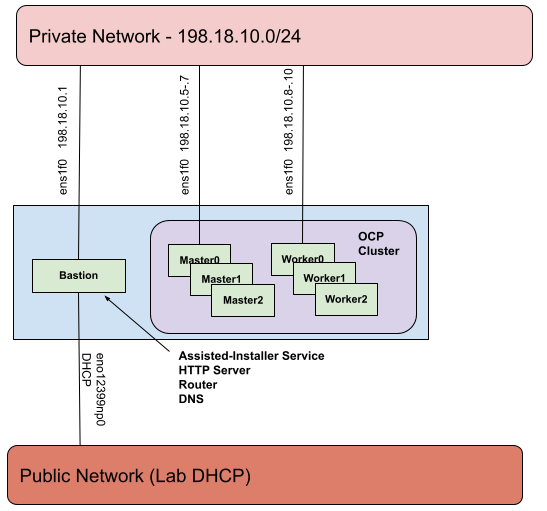

# Deploy a Multi Node OpenShift cluster via Jetlag without create-inventory playbook, BYOL (Bring Your Own Lab), quickstart

In a BYOL you will have to write your own Jetlag inventory file as the `create-inventory.yml` playbook can **not** be used. You must gather information regarding the machines such as network interface names, bmc addresses, MAC addresses, and dns servers in order to assemble an inventory file and all.yml vars file. If you have a non-homogenous set of machines, it is recommended to group machines of same/similar models to be the cluster's control-plane and worker nodes. If you have 2 or more types/configurations of machines, you should use only one type/configuration for control-plane nodes and the remaining types/configurations all as worker nodes.

The bastion machine needs 2 interfaces:
- `bastion_lab_interface` - The "lab network" interface, from which you can ssh into your bastion machine (connected to the lab/public network usually a L3 network with an IP assigned).
- `bastion_controlplane_interface` - The "control-plane network" interface, from which the cluster nodes are accessed (this is a L2 network and it does not usually have an IP assigned). This is typically a private network connecting all machines.

Depending on the lab, the bastion machine may have firewall rules in place that prevent proper connectivity from the target cluster machines to the assisted-service API hosted on the bastion. Depending on the lab setup, you might need to add rules to allow this traffic, or if the bastion machine is already behind a firewall, the firewall could be disabled. You should check both `firewalld` and/or `iptables`.

The public interface to each of your OpenShift cluster machines needs to be identified so jetlag can disable the interfaces via both the interface name (`controlplane_lab_interface` in all.yml) and mac address in the inventory file per node (Ex `lab_mac=ec:2a:72:33:15:f0`).

The OpenShift cluster machines need a minimum of 1 online private interface:
- The control-plane interface, from which other cluster nodes are accessed. The mac address for each node is set in the inventory per host (Ex. `mac_address=40:a6:b7:83:98:b0`)

Since each node's NIC is on a L2 network, choose whichever L2 network is available as the control-plane network. See the network diagram below as an example:



_**Table of Contents**_

<!-- TOC -->
- [Bastion setup](#bastion-setup)
- [Configure Ansible vars in `all.yml`](#configure-ansible-vars-in-allyml)
- [Review vars `all.yml`](#review-vars-allyml)
- [Create your custom inventory `byol.local`](#create-your-custom-inventory-byollocal)
- [Monitor install and interact with cluster](#monitor-install-and-interact-with-cluster)
- [Appendix - Troubleshooting, etc.](#appendix---troubleshooting-etc)
<!-- /TOC -->

<!-- Bastion setup is duplicated in multiple files and should be kept in sync!
     - deploy-mno-byol.md
     - deploy-mno-ibmcloud.md
     - deploy-mno-performancelab.md
     - deploy-mno-scalelab.md
     - deploy-sno-ibmcloud.md
     - deploy-sno-scalelab.md
     - deploy-sno-performancelab.md
 -->
## Bastion setup

1. Select the bastion machine from the allocation. You should run Jetlag on the
bastion machine, to ensure full connectivity and fastest access. By convention
this is usually the first node of your allocation: for example, the first machine
listed in your cloud platform's standard inventory display.

2. You can copy your ssh public key to the designated bastion machine to make it easier to
repeatedly log in from your laptop:

```console
[user@<local> ~]$ ssh-copy-id root@<bastion>
/usr/bin/ssh-copy-id: INFO: attempting to log in with the new key(s), to filter out any that are already installed
/usr/bin/ssh-copy-id: INFO: 2 key(s) remain to be installed -- if you are prompted now it is to install the new keys
Warning: Permanently added '<bastion>,x.x.x.x' (ECDSA) to the list of known hosts.
root@<bastion>'s password:

Number of key(s) added: 2

# Now try logging into the machine, and confirm that only the expected key(s)
# were added to ~/.ssh/known_hosts
[user@<local> ~]$ ssh root@<bastion>
[root@<bastion> ~]#
```

Now log in to the bastion (with `ssh root@<bastion>` if you copied your public key above,
or using the bastion root account password if not), because the remaining commands
should be executed from the bastion.

3. Install some additional tools to help after reboot

```console
[root@<bastion> ~]# dnf install tmux git python3-pip sshpass -y
Updating Subscription Management repositories.
...
Complete!
```

4. Setup ssh keys for the bastion root account and copy to itself to permit
local ansible interactions:

```console
[root@<bastion> ~]# ssh-keygen
Generating public/private rsa key pair.
Enter file in which to save the key (/root/.ssh/id_rsa):
Enter passphrase (empty for no passphrase):
Enter same passphrase again:
Your identification has been saved in /root/.ssh/id_rsa.
Your public key has been saved in /root/.ssh/id_rsa.pub.
The key fingerprint is:
SHA256:uA61+n0w3Dht4/oIy1IKXrSgt9tfC/8zjICd7LJ550s root@<bastion>
The key's randomart image is:
+---[RSA 3072]----+
...
+----[SHA256]-----+
[root@<bastion> ~]# ssh-copy-id root@localhost
/usr/bin/ssh-copy-id: INFO: Source of key(s) to be installed: "/root/.ssh/id_rsa.pub"
The authenticity of host 'localhost (127.0.0.1)' can't be established.
ECDSA key fingerprint is SHA256:fvvO3NLxT9FPcoOKQ9ldVdd4aQnwuGVPwa+V1+/c4T8.
Are you sure you want to continue connecting (yes/no/[fingerprint])? yes
/usr/bin/ssh-copy-id: INFO: attempting to log in with the new key(s), to filter out any that are already installed
/usr/bin/ssh-copy-id: INFO: 1 key(s) remain to be installed -- if you are prompted now it is to install the new keys
root@localhost's password:

Number of key(s) added: 1

Now try logging into the machine and check to make sure that only the key(s) you wanted were added:
```console
[root@<bastion> ~]# ssh root@localhost
[root@<bastion> ~]#
```

5. Clone the `jetlag` GitHub repo

```console
[root@<bastion> ~]# git clone https://github.com/redhat-performance/jetlag.git
Cloning into 'jetlag'...
remote: Enumerating objects: 4510, done.
remote: Counting objects: 100% (4510/4510), done.
remote: Compressing objects: 100% (1531/1531), done.
remote: Total 4510 (delta 2450), reused 4384 (delta 2380), pack-reused 0
Receiving objects: 100% (4510/4510), 831.98 KiB | 21.33 MiB/s, done.
Resolving deltas: 100% (2450/2450), done.
```

The `git clone` command will normally set the local head to the Jetlag repo's
`main` branch. To set your local head to a different branch or tag (for example,
a development branch), you can add `-b <name>` to the command.

Change your working directory to the repo's `jetlag` directory, which we'll assume
for subsequent steps:

```console
[root@<bastion> ~]# cd jetlag
[root@<bastion> jetlag]#
```

6. Download your `pull-secret.txt` from [console.redhat.com/openshift/downloads](https://console.redhat.com/openshift/downloads) into the root directory of your Jetlag repo on the bastion. You'll find the Pull Secret near the end of
the long downloads page, in the section labeled "Tokens". You can either click the "Download" button, and then copy the
downloaded file to `~/jetlag/pull-secret.txt` on the bastion; *or* click on the "Copy" button, and then paste the clipboard into the terminal
after typing `cat >pull-secret.txt` on the bastion to create the expected filename:

```console
[root@<bastion> jetlag]# cat >pull-secret.txt
{
  "auths": {
    "quay.io": {
      "auth": "XXXXXXX",
      "email": "XXXXXXX"
    },
    "registry.connect.redhat.com": {
      "auth": "XXXXXXX",
      "email": "XXXXXXX"
    },
    "registry.redhat.io": {
      "auth": "XXXXXXX",
      "email": "XXXXXXX"
    }
  }
}
```

If you are deploying nightly builds then you will need to add a ci token and an entry for
`registry.ci.openshift.org`. If you plan on deploying an ACM downstream build be sure to
include an entry for `quay.io:443`.

7. Execute the bootstrap script in the current shell, with `source bootstrap.sh`.
This will activate a local virtual Python environment configured with the Jetlag and
Ansible dependencies.

```console
[root@<bastion> jetlag]# source bootstrap.sh
Collecting pip
...
(.ansible) [root@<bastion> jetlag]#
```

You can re-enter that virtual environment when you log in to the bastion again
with:

```console
[root@<bastion> ~]# cd jetlag
[root@<bastion> jetlag]# source .ansible/bin/activate
```

<!-- End of duplicated setup text -->

## Configure Ansible vars in `all.yml`

Copy the vars file and edit it to create the inventory with your BYOL lab info:

```console
(.ansible) [root@<bastion> jetlag]# cp ansible/vars/all.sample.yml ansible/vars/all.yml
(.ansible) [root@<bastion> jetlag]# vi ansible/vars/all.yml
```

### Lab & cluster infrastructure vars

Change `lab` to `lab: byol`

Leave `lab_cloud` unset or empty.

Change `cluster_type` to `cluster_type: mno`

Set `worker_node_count` to count of workers available in the testbed, in this guide it is set to `2`. Set it to `0`, if you want a 3 node compact cluster.

Set `ocp_build` to `ga` for Generally Available versions, `dev` (early candidate builds)
of OpenShift, or `ci` to pick a specific nightly build.

`ocp_version` is used in conjunction with `ocp_build`. Examples of `ocp_version` with
`ocp_build: ga` include explicit versions such as `4.17.17` or `4.16.35`, additionally
`latest-4.17` or `latest-4.16` point to the latest z-stream of 4.17 and 4.16 ga builds.
Examples of `ocp_version` with `ocp_build: dev` are `candidate-4.17`, `candidate-4.16`
or `latest` which points to the early candidate build of the latest in development
release. Checkout https://mirror.openshift.com/pub/openshift-v4/clients/ocp/ for a list
of available builds for `ga` releases and https://mirror.openshift.com/pub/openshift-v4/clients/ocp-dev-preview/
for a list of `dev` releases. Nightly `ci` builds are tricky and require determining
exact builds you can use, an example of `ocp_version` with `ocp_build: ci` is
`4.19.0-0.nightly-2025-02-25-035256`.

Note: user has to add registry.ci.openshift.org token in pull-secret.txt for `ci` builds.

### Bastion node vars

Set `smcipmitool_url` to the location of the Supermicro SMCIPMITool binary. Since you must accept a EULA in order to download, it is suggested to download the file and place it onto a local http server, that is accessible to your laptop or deployment machine. You can then always reference that URL. Alternatively, you can download it to the `ansible/` directory of your Jetlag repo clone and rename the file to `smcipmitool.tar.gz`. You can find the file [here](https://www.supermicro.com/SwDownload/SwSelect_Free.aspx?cat=IPMI).

* `bastion_lab_interface` should be the public lab network interface for your bastion
* `bastion_controlplane_interface` should be the private network interface that connects your bastion to the OCP cluster nodes

For the hardware in this guide, set those vars to the following (Your hardware will be different, and you must determine those values):

```yaml
bastion_lab_interface: eno8303
bastion_controlplane_interface: ens1f0
```

### OCP node vars

* `controlplane_lab_interface` should be the public lab interface on your OCP cluster nodes

For the hardware in this guide, set this var to the following (Your hardware will be different, and you must determine the correct interface):

```yaml
controlplane_lab_interface: eno8303
```

### Extra vars

BYOL requires dns and ntp servers to be set in extra vars in the follow data structure:

```yaml
labs:
  byol:
    dns:
    - x.x.x.x
    - y.y.y.y
    ntp_server: clock.redhat.com
```

You can determine what your typical testbed's dns servers are by reviewing `/etc/resolv.conf` on the bastion machine.

## Review vars `all.yml`

The `ansible/vars/all.yml` now resembles ...

```yaml
---
# Sample vars file
################################################################################
# Lab & cluster infrastructure vars
################################################################################
# Which lab to be deployed into (Ex byol)
lab: byol
# Which cloud in the lab environment (Ex cloud42)
lab_cloud:

# Either mno or sno
cluster_type: mno

# Applies to mno clusters
worker_node_count: 2

# Set ocp_build to "ga", `dev`, or `ci` to pick a specific nightly build
ocp_build: "ga"

# ocp_version is used in conjunction with ocp_build
# For "ga" builds, examples are "latest-4.17", "latest-4.16", "4.17.17" or "4.16.35"
# For "dev" builds, examples are "candidate-4.17", "candidate-4.16" or "latest"
# For "ci" builds, an example is "4.19.0-0.nightly-2025-02-25-035256"
ocp_version: "latest-4.20"

# Set to true ONLY if you have a public routable vlan in your scalelab or performancelab cloud.
# Autoconfigures cluster_name, base_dns_name, controlplane_network_interface_idx, controlplane_network,
# controlplane_network_prefix, and controlplane_network_gateway to the values required for your cloud's public VLAN.
# SNO configures only the first cluster on the api dns resolvable address
# MNO/SNO still requires the correct value for bastion_controlplane_interface
public_vlan: false

# SNOs only require a single IP address and can be deployed using the lab DHCP interface instead of a private or
# public vlan network. Set to true to have your SNO deployed on the public lab DHCP network.
# Cannot combine public_vlan and sno_use_lab_dhcp
sno_use_lab_dhcp: false

# Enables FIPs security standard
enable_fips: false

# Enables Operators CNV and LSO install at deployment timeframe (GA releases only)
enable_cnv_install: false

ssh_private_key_file: ~/.ssh/id_rsa
ssh_public_key_file: ~/.ssh/id_rsa.pub
# Place your pull-secret.txt in the base directory of the cloned Jetlag repo, Example:
# [root@<bastion> jetlag]# ls pull-secret.txt
pull_secret: "{{ lookup('file', '../pull-secret.txt') }}"

################################################################################
# Bastion node vars
################################################################################
bastion_cluster_config_dir: /root/{{ cluster_type }}

smcipmitool_url:

bastion_lab_interface: eno8303
bastion_controlplane_interface: ens1f0

# Sets up Gogs a self-hosted git service on the bastion
setup_bastion_gogs: false

# Set to enable and sync container images into a container image registry on the bastion
setup_bastion_registry: false

# Use in conjunction with ipv6 based clusters
use_bastion_registry: false

################################################################################
# OCP node vars
################################################################################
# Network configuration for all mno/sno cluster nodes
controlplane_lab_interface: eno8303

################################################################################
# Extra vars
################################################################################
# Append override vars below
labs:
  byol:
    dns:
    - x.x.x.x
    - y.y.y.y
    ntp_server: clock.redhat.com
```

## Create your custom inventory `byol.local`

Choose wisely which server for which role: bastion, masters and workers. Make sure to group machines by, e.g., number of cores, NIC types (and names), etc.

- Record the names and MACs of the L3 network interfaces to be used for the inventory.
- Record the names and MACs of the L2 network interfaces for the control-plane network.
- Make sure you have root access to the BMC, i.e., iDRAC for Dell. In the example below, the *bmc_user* and *bmc_password* are set to root and password.

Copy the sample byol inventory file and edit it:

```console
(.ansible) [root@<bastion> jetlag]# cp ansible/inventory/byol-mno.sample ansible/inventory/byol.local
(.ansible) [root@<bastion> jetlag]# vi ansible/inventory/byol.local
```

Make sure to replace the IP addresses, mac addresses, install disk by-paths, interface names, and dns servers with correct values for your environment.

> [!NOTE]
> **BYOL Environments:** Unlike Scale Lab and Performance Lab deployments, BYOL environments do not
> benefit from automatic install disk selection. You must manually specify install disk paths using
> `/dev/disk/by-path/` references for each node in your inventory file. See the
> [Install disk by-path vars](tips-and-vars.md#install-disk-by-path-vars) section for guidance on
> finding the correct paths for your hardware.

```
# Bring Your Own Lab (BYOL) Sample Inventory
[all:vars]
allocation_node_count=6
supermicro_nodes=False
cluster_name=mno
controlplane_network=198.18.0.0/16
controlplane_network_prefix=16
base_dns_name=example.com

[bastion]
<FQDN> ansible_ssh_user=root bmc_address=<IP or FQDN> lab_ip=<public reachable ip of bastion>

[bastion:vars]
bmc_user=root
bmc_password=password

[controlplane]
control-plane-0 bmc_address=<IP or FQDN> mac_address=<L2 NIC> lab_mac=<L3 NIC> ip=198.18.0.5 vendor=Dell install_disk=/dev/disk/by-path/...
control-plane-1 bmc_address=<IP or FQDN> mac_address=<L2 NIC> lab_mac=<L3 NIC> ip=198.18.0.6 vendor=Dell install_disk=/dev/disk/by-path/...
control-plane-2 bmc_address=<IP or FQDN> mac_address=<L2 NIC> lab_mac=<L3 NIC> ip=198.18.0.7 vendor=Dell install_disk=/dev/disk/by-path/...

[controlplane:vars]
role=master
boot_iso=discovery.iso
bmc_user=root
bmc_password=password
lab_interface=<lab_mac interface name>
network_interface=<anything>
network_prefix=16
gateway=198.18.0.1
dns1=198.18.0.1
dns2=<DNS ip_address>

[worker]
worker-0 bmc_address=<IP or FQDN> mac_address=<L2 NIC> lab_mac=<L3 NIC> ip=198.18.0.8 vendor=Dell install_disk=/dev/disk/by-path/...
worker-1 bmc_address=<IP or FQDN> mac_address=<L2 NIC> lab_mac=<L3 NIC> ip=198.18.0.9 vendor=Dell install_disk=/dev/disk/by-path/...

[worker:vars]
role=worker
boot_iso=discovery.iso
bmc_user=root
bmc_password=password
lab_interface=<lab_mac interface name>
network_interface=<anything>
network_prefix=16
gateway=198.18.0.1
dns1=198.18.0.1
dns2=<DNS ip_address>

[sno]
[sno:vars]
[hv]
[hv:vars]
[hv_vm]
[hv_vm:vars]
```
You can see the real example file for the above inventory [here](https://github.com/redhat-performance/jetlag/blob/main/ansible/inventory/byol-mno.sample).

Next run the `setup-bastion.yml` playbook ...

```console
(.ansible) [root@<bastion> jetlag]# ansible-playbook -i ansible/inventory/byol.local ansible/setup-bastion.yml
...
```

Finally run the `mno-deploy.yml` playbook ...

```console
(.ansible) [root@<bastion> jetlag]# ansible-playbook -i ansible/inventory/byol.local ansible/mno-deploy.yml
...
```

## Monitor install and interact with cluster

You should monitor the first deployment to see if anything hangs on boot, or if the virtual media is incorrect according to the BMC. You can monitor the deployment by opening the bastion's `assisted-installer` GUI (port 8080, ex `http://<bastion>:8080/clusters`), opening the consoles via the BMC, i.e., iDRAC for Dell, of each machine, and once the machines are booted, you can directly connect to them and tail log files.

If everything goes well, you should have a cluster in about 40-70 minutes (Dependent upon reboot timings). You can interact with the cluster from the bastion.

```console
(.ansible) [root@<bastion> jetlag]# export KUBECONFIG=/root/mno/kubeconfig
(.ansible) [root@<bastion> jetlag]# oc get no
NAME              STATUS   ROLES                  AGE   VERSION
control-plane-0   Ready    control-plane,master   36m   v1.27.6+f67aeb3
control-plane-1   Ready    control-plane,master   61m   v1.27.6+f67aeb3
control-plane-2   Ready    control-plane,master   63m   v1.27.6+f67aeb3
worker-0          Ready    worker                 38m   v1.27.6+f67aeb3
worker-1          Ready    worker                 39m   v1.27.6+f67aeb3
```

## Appendix - Troubleshooting, etc.

In BYOL, the cluster installation process is divided into two phases: (1) Setup the bastion machine and (2) the OCP installation.

### (1) Setup bastion
- Make sure that the base operating system (in the case of this guide it was RHEL 9.2) in the bastion machine has repositories added and an active subscription, since Jetlag requires some packages, such as: `dnsmasq`, `frr`, `golang-bin`, `httpd` and `httpd-tools`, `ipmitool`, `python3-pip`, `podman`, and `skopeo`.

- Sometimes the setup bastion process may fail, because it is not able to have connectivity between the assisted-service API and the target cluster machines. Check for `firewalld` or `iptables` with rules in place that prevent traffic between these machines. A quick test that fixes the problem is to silence and/or disable `firewalld` and clean `iptables` rules.

- For Jetlag to be able to copy, change the boot order, and boot the machines from the RHCOS image, the user needs to have writing access to the BMC, i.e., iDRAC in the case of Dell machines.

- The installation disks on the machines could vary from SATA/SAS to NVME, and therefore the `/dev/disk/by-path` IDs will vary.

- The task ''Stop and disable iptables'' can fail because `dnf install iptables-services` and `systemctl start` need to be performed.

### (2) MNO-Deploy
- The task "Dell - Insert Virtual Media" may fail. Silencing `firewalld` and `iptables` fixed it.

- The task "Dell - Power down machine prior to booting iso" executes the `ipmi` command against the machines, where OCP will be installed. It may fail in some cases, where [reseting idrac](https://github.com/redhat-performance/jetlag/blob/main/docs/troubleshooting.md#dell---reset-bmc--idrac) is not enough. As a workaround, one can set the machines to boot from the .iso, via the virtual console.

- The task "Wait up to 40 min for nodes to be discovered" is the last most important step. Make sure that the *boot order* (via the *boot type*) is correct:
  - Check the virtual console in the BMC, i.e., iDRAC for Dell, if the machines are booting correctly from the .iso image.

  - Make sure to inspect the 'BIOS Settings' in the machine for both, the *boot order* and *boot type*. Jetlag will mount the .iso and instruct the machines for a one-time boot, where, later, they should be able to boot from the disk. Check if the string in the boot order field contains the hard disk. Once booted, in the virtual console, you will see the L3 NIC interface with an 198.18.0.x address and RHCOS, which is correct according to the `byol.local` above.
  - If the machines boot from the .iso image, but they cannot reach the bastion, it is most likely a networking issue, i.e. double check L2 and L3 NIC interfaces again.
     - [badfish](https://github.com/redhat-performance/badfish) could be used for this purpose, however, it is limited to use only FQDN, and, by the time of writing, the configuration for Del R660 and R760 in the interface config file was missing.

- In the assistant installer GUI, under cluster events, if you observe any *permission denied* error, it is related to the SELinux issue pointed out previously. If you however notice an issue related to *wrong booted device*, make sure to observe in the virtual console in the BMC, if the machines booted from the disk, and if the boot order contains the disk option. This is a classic boot order issue. The steps in the assistant installer are that the control-plane nodes will boot from the disk to be configured, and then join the control-plane "nominated" as the bootstrap node (this happens around 45-47% of the installation) to continue with the installation of the worker nodes.
