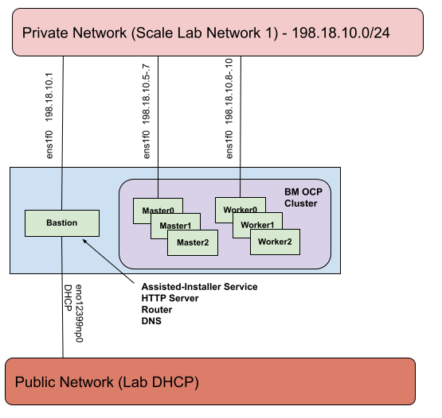

# Deploy a Multi node cluster via Jetlag from a Performance Lab Bastion Machine quickstart

Assuming you received an Performance lab allocation named `cloud99`, this guide will walk you through getting a multi node cluster up in your allocation. For purposes of the guide the systems in `cloud99` will be Dell r750s. You should run Jetlag directly on the bastion machine. Jetlag picks the first machine in an allocation as the bastion. You can [trick Jetlag into picking a different machine as the bastion](tips-and-vars.md#override-lab-ocpinventory-json-file) but that is beyond the scope of this quickstart.

_**Table of Contents**_

<!-- TOC -->
- [Deploy a Multi node cluster via Jetlag from a Performance Lab Bastion Machine quickstart](#deploy-a-bare-metal-cluster-via-jetlag-from-a-performance-lab-bastion-machine-quickstart)
  - [Bastion setup](#bastion-setup)
  - [Configure Ansible vars in `all.yml`](#configure-ansible-vars-in-allyml)
    - [Lab \& cluster infrastructure vars](#lab--cluster-infrastructure-vars)
    - [Bastion node vars](#bastion-node-vars)
    - [OCP node vars](#ocp-node-vars)
    - [Deploy in the public VLAN](#deploy-in-the-public-vlan)
    - [Extra vars](#extra-vars)
    - [Disconnected and ipv6 vars](#disconnected-and-ipv6-vars)
  - [Review vars `all.yml`](#review-vars-allyml)
  - [Run playbooks](#run-playbooks)
  - [Monitor install and interact with cluster](#monitor-install-and-interact-with-cluster)
<!-- /TOC -->

<!-- Bastion setup is duplicated in multiple files and should be kept in sync!
     - deploy-mno-byol.md
     - deploy-mno-ibmcloud.md
     - deploy-mno-performancelab.md
     - deploy-mno-scalelab.md
     - deploy-sno-ibmcloud.md
     - deploy-sno-scalelab.md
     - deploy-sno-performancelab.md
 -->
## Bastion setup

1. Select the bastion machine from the allocation. You should run Jetlag on the
bastion machine, to ensure full connectivity and fastest access. By convention
this is usually the first node of your allocation: for example, the first machine
listed in your cloud platform's standard inventory display.

2. You can copy your ssh public key to the designated bastion machine to make it easier to
repeatedly log in from your laptop:

```console
[user@<local> ~]$ ssh-copy-id root@<bastion>
/usr/bin/ssh-copy-id: INFO: attempting to log in with the new key(s), to filter out any that are already installed
/usr/bin/ssh-copy-id: INFO: 2 key(s) remain to be installed -- if you are prompted now it is to install the new keys
Warning: Permanently added '<bastion>,x.x.x.x' (ECDSA) to the list of known hosts.
root@<bastion>'s password:

Number of key(s) added: 2
```

Now log in to the bastion (with `ssh root@<bastion>` if you copied your public key above,
or using the bastion root account password if not), because the remaining commands
should be executed from the bastion.

3. Install some additional tools to assist you.

```console
[root@<bastion> ~]# dnf install tmux git python3-pip sshpass -y
Updating Subscription Management repositories.
...
Complete!
```

4. Setup ssh keys for the bastion root account and copy to itself to permit
local ansible interactions:

```console
[root@<bastion> ~]# ssh-keygen
Generating public/private rsa key pair.
Enter file in which to save the key (/root/.ssh/id_rsa):
Enter passphrase (empty for no passphrase):
Enter same passphrase again:
Your identification has been saved in /root/.ssh/id_rsa.
Your public key has been saved in /root/.ssh/id_rsa.pub.
The key fingerprint is:
SHA256:uA61+n0w3Dht4/oIy1IKXrSgt9tfC/8zjICd7LJ550s root@<bastion>
The key's randomart image is:
+---[RSA 3072]----+
...
+----[SHA256]-----+
[root@<bastion> ~]# ssh-copy-id root@localhost
/usr/bin/ssh-copy-id: INFO: Source of key(s) to be installed: "/root/.ssh/id_rsa.pub"
The authenticity of host 'localhost (127.0.0.1)' can't be established.
ECDSA key fingerprint is SHA256:fvvO3NLxT9FPcoOKQ9ldVdd4aQnwuGVPwa+V1+/c4T8.
Are you sure you want to continue connecting (yes/no/[fingerprint])? yes
/usr/bin/ssh-copy-id: INFO: attempting to log in with the new key(s), to filter out any that are already installed
/usr/bin/ssh-copy-id: INFO: 1 key(s) remain to be installed -- if you are prompted now it is to install the new keys
root@localhost's password:

Number of key(s) added: 1

Now try logging into the machine and check to make sure that only the key(s) you wanted were added:
```console
[root@<bastion> ~]# ssh root@localhost
[root@<bastion> ~]#
```

5. Clone the `jetlag` GitHub repo

```console
[root@<bastion> ~]# git clone https://github.com/redhat-performance/jetlag.git
Cloning into 'jetlag'...
remote: Enumerating objects: 4510, done.
remote: Counting objects: 100% (4510/4510), done.
remote: Compressing objects: 100% (1531/1531), done.
remote: Total 4510 (delta 2450), reused 4384 (delta 2380), pack-reused 0
Receiving objects: 100% (4510/4510), 831.98 KiB | 21.33 MiB/s, done.
Resolving deltas: 100% (2450/2450), done.
```

The `git clone` command will normally set the local head to the Jetlag repo's
`main` branch. To set your local head to a different branch or tag (for example,
a development branch), you can add `-b <name>` to the command.

Change your working directory to the repo's `jetlag` directory, which we'll assume
for subsequent steps:

```console
[root@<bastion> ~]# cd jetlag
[root@<bastion> jetlag]#
```

6. Download your `pull_secret.txt` from [console.redhat.com/openshift/downloads](https://console.redhat.com/openshift/downloads) into the root directory of your Jetlag repo on the bastion. You'll find the Pull Secret near the end of
the long downloads page, in the section labeled "Tokens". You can either click the "Download" button, and then copy the
downloaded file to `~/jetlag/pull_secret.txt` on the bastion (notice that Jetlag expects an underscore (`_`) while the
file will download with a hyphen (`-`)); *or* click on the "Copy" button, and then paste the clipboard into the terminal
after typing `cat >pull_secret.txt` on the bastion to create the expected filename:

```console
[root@<bastion> jetlag]# cat >pull_secret.txt
{
  "auths": {
    "quay.io": {
      "auth": "XXXXXXX",
      "email": "XXXXXXX"
    },
    "registry.connect.redhat.com": {
      "auth": "XXXXXXX",
      "email": "XXXXXXX"
    },
    "registry.redhat.io": {
      "auth": "XXXXXXX",
      "email": "XXXXXXX"
    }
  }
}
```

If you are deploying nightly builds then you will need to add a ci token and an entry for
`registry.ci.openshift.org`. If you plan on deploying an ACM downstream build be sure to
include an entry for `quay.io:443`.

7. Execute the bootstrap script in the current shell, with `source bootstrap.sh`.
This will activate a local virtual Python environment configured with the Jetlag and
Ansible dependencies.

```console
[root@<bastion> jetlag]# source bootstrap.sh
Collecting pip
...
(.ansible) [root@<bastion> jetlag]#
```

You can re-enter that virtual environment when you log in to the bastion again
with:

```console
[root@<bastion> ~]# cd jetlag
[root@<bastion> jetlag]# source .ansible/bin/activate
```

<!-- End of duplicated setup text -->

## Configure Ansible vars in `all.yml`

Copy the sample vars file and edit it:

```console
(.ansible) [root@xxx-h01-000-r750 jetlag]# cp ansible/vars/all.sample.yml ansible/vars/all.yml
(.ansible) [root@xxx-h01-000-r750 jetlag]# vi ansible/vars/all.yml
```

### Lab & cluster infrastructure vars

Change `lab` to `lab: performancelab`

Change `lab_cloud` to `lab_cloud: cloud99`

Change `cluster_type` to `cluster_type: mno`

Set `worker_node_count` to limit the number of worker nodes from your Performance lab allocation. Set it to `0` if you want a 3 node compact cluster.

Set `ocp_build` to `ga` for Generally Available versions, `dev` (early candidate builds)
of OpenShift, or `ci` to pick a specific nightly build.

`ocp_version` is used in conjunction with `ocp_build`. Examples of `ocp_version` with
`ocp_build: ga` include explicit versions such as `4.17.17` or `4.16.35`, additionally
`latest-4.17` or `latest-4.16` point to the latest z-stream of 4.17 and 4.16 ga builds.
Examples of `ocp_version` with `ocp_build: dev` are `candidate-4.17`, `candidate-4.16`
or `latest` which points to the early candidate build of the latest in development
release. Checkout https://mirror.openshift.com/pub/openshift-v4/clients/ocp/ for a list
of available builds for `ga` releases and https://mirror.openshift.com/pub/openshift-v4/clients/ocp-dev-preview/
for a list of `dev` releases. Nightly `ci` builds are tricky and require determining
exact builds you can use, an example of `ocp_version` with `ocp_build: ci` is
`4.19.0-0.nightly-2025-02-25-035256`.

Note: user has to add registry.ci.openshift.org token in pull_secret.txt for `ci` builds.

### Bastion node vars

Set `smcipmitool_url` to the location of the Supermicro SMCIPMITool binary. Since you must accept a EULA in order to download, it is suggested to download the file and place it onto a local http server, that is accessible to your laptop or deployment machine. You can then always reference that URL. Alternatively, you can download it to the `ansible/` directory of your Jetlag repo clone and rename the file to `smcipmitool.tar.gz`. You can find the file [here](https://www.supermicro.com/SwDownload/SwSelect_Free.aspx?cat=IPMI).

**Network Interface Configuration:**

Jetlag automatically detects and configures network interfaces for common hardware in Scale Lab and Performance Lab using the `hw_nic_name` [mapping](../ansible/vars/lab.yml). You only need to manually set these if you want to override the defaults. For more details see [tips-and-vars.md](tips-and-vars.md).

Here you can see a network diagram for the multi node metal cluster on Dell r750 with 3 workers and 3 master nodes:



** If you desire to use a *different network* than "Network 1" for your controlplane network then you will have to append additional overrides to the extra vars portion of the `all.yml` vars file.
See [tips and vars](tips-and-vars.md#using-other-network-interfaces) for more information

### OCP node vars

Network configuration is automatically detected based on lab and hardware type. See the [Network Interface Configuration](#bastion-node-vars) section above.

### Deploy in the public VLAN

In order to deploy a cluster using the public VLAN, set the variable `public_vlan` in `all.yml` to `true`. Once enabled the following variables are automatically configured:

- `cluster_name`: cluster name according to the pre-existing DNS records in the public VLAN, i.e: `vlan604`
- `base_dns_name` is set to the proper base dns name in the inventory
- `controlplane_network_interface_idx`: Is set to the corresponding interface number
- `controlplane_network`: public VLAN subnet
- `controlplane_network_prefix`: public VLAN network mask
- `controlplane_network_gateway`: public VLAN default gateway

When the deployment is completed, the cluster API and routes should be reachable directly from the VPN.

### Extra vars

**Install Disk Configuration:**

For most common hardware types in Performance Lab (r740xd, r750, r7425, r7525, r760, 6029p, xe8640, xe9680),
Jetlag **automatically selects** the correct install disk using persistent `/dev/disk/by-path/` references.
These automatic mappings are defined in `ansible/vars/lab.yml` under `hw_install_disk`.

You **only need to set** `control_plane_install_disk` and `worker_install_disk` if:
- Your hardware model is not in the automatic mappings
- You need a different disk than the default for your hardware model
- You want to explicitly override the automatic selection

The values shown in the example [Review `all.yml`](#review-vars-allyml) below are for Dell r750 as a reference.
Please refer to [tips and vars](tips-and-vars.md#install-disk-by-path-vars) for the complete list of automatic
mappings and guidance on finding disk paths for unsupported hardware.

### Disconnected and ipv6 vars

If you want to deploy a disconnected ipv6 cluster then the following vars need to be set.

Change `setup_bastion_registry` to `setup_bastion_registry: true` and `use_bastion_registry` to `use_bastion_registry: true` under "Bastion node vars"

Append the following "override" vars in "Extra vars"

```yaml
controlplane_network: fc00:1000::/64
controlplane_network_prefix: 64
cluster_network_cidr: fd01::/48
cluster_network_host_prefix: 64
service_network_cidr: fd02::/112
fix_metal3_provisioningosdownloadurl: true
```

Oddly enough if you run into any routing issues because of duplicate address detection, determine if someone else is using subnet `fc00:1000::/64` in the same lab environment and adjust accordingly.

The completed `all.yml` vars file and generated inventory files following this section only reflect that of an ipv4 connected install. If you previously deployed ipv4 stop and remove all running podman containers off the bastion and rerun the `setup-bastion.yml` playbook.

## Review vars `all.yml`

The `ansible/vars/all.yml` now resembles ..

```yaml
---
# Sample vars file
################################################################################
# Lab & cluster infrastructure vars
################################################################################
# Which lab to be deployed into (Ex performancelab)
lab: performancelab
# Which cloud in the lab environment (Ex cloud42)
lab_cloud: cloud99

# Either mno or sno
cluster_type: mno

# Applies to mno clusters
worker_node_count: 2

# Set ocp_build to "ga", `dev`, or `ci` to pick a specific nightly build
ocp_build: "ga"

# ocp_version is used in conjunction with ocp_build
# For "ga" builds, examples are "latest-4.17", "latest-4.16", "4.17.17" or "4.16.35"
# For "dev" builds, examples are "candidate-4.17", "candidate-4.16" or "latest"
# For "ci" builds, an example is "4.19.0-0.nightly-2025-02-25-035256"
ocp_version: "latest-4.20"

# Set to true ONLY if you have a public routable vlan in your scalelab or performancelab cloud.
# Autoconfigures cluster_name, base_dns_name, controlplane_network_interface_idx, controlplane_network,
# controlplane_network_prefix, and controlplane_network_gateway to the values required for your cloud's public VLAN.
# SNO configures only the first cluster on the api dns resolvable address
public_vlan: false

# SNOs only require a single IP address and can be deployed using the lab DHCP interface instead of a private or
# public vlan network. Set to true to have your SNO deployed on the public lab DHCP network.
# Cannot combine public_vlan and sno_use_lab_dhcp
sno_use_lab_dhcp: false

# Enables FIPs security standard
enable_fips: false

# Enables Operators CNV and LSO install at deployment timeframe (GA releases only)
enable_cnv_install: false

ssh_private_key_file: ~/.ssh/id_rsa
ssh_public_key_file: ~/.ssh/id_rsa.pub
# Place your pull_secret.txt in the base directory of the cloned Jetlag repo, Example:
# [root@<bastion> jetlag]# ls pull_secret.txt
pull_secret: "{{ lookup('file', '../pull_secret.txt') }}"

################################################################################
# Bastion node vars
################################################################################
bastion_cluster_config_dir: /root/{{ cluster_type }}

smcipmitool_url:

# Network interfaces - auto-configured based on lab and hardware type
# Uncomment to override:
# bastion_lab_interface: eno8303
# bastion_controlplane_interface: ens3f0

# Sets up Gogs a self-hosted git service on the bastion
setup_bastion_gogs: false

# Set to enable and sync container images into a container image registry on the bastion
setup_bastion_registry: false

# Use in conjunction with ipv6 based clusters
use_bastion_registry: false

################################################################################
# OCP node vars
################################################################################
# Network configuration - auto-configured based on lab and hardware type
# Uncomment to override:
# controlplane_lab_interface: eno8303

################################################################################
# Extra vars
################################################################################
# Append override vars below
control_plane_install_disk: /dev/disk/by-path/pci-0000:65:00.0-scsi-0:2:0:0
worker_install_disk: /dev/disk/by-path/pci-0000:65:00.0-scsi-0:2:0:0
```

## Run playbooks

Run the create inventory playbook

```console
(.ansible) [root@<bastion> jetlag]# ansible-playbook ansible/create-inventory.yml
...
```

The `create-inventory.yml` playbook will create an inventory file `ansible/inventory/cloud99.local` from the lab allocation data and the vars file.

The inventory file resembles ...

```
[all:vars]
allocation_node_count=16
supermicro_nodes=False

[bastion]
xxx-h01-000-r750.example.com ansible_ssh_user=root bmc_address=mgmt-xxx-h01-000-r750.example.com lab_ip=10.1.x.x

[bastion:vars]
bmc_user=quads
bmc_password=XXXXXXX

[controlplane]
xxx-h02-000-r750 bmc_address=mgmt-xxx-h02-000-r750.example.com mac_address=b4:96:91:cb:ec:02 lab_mac=5c:6f:69:75:c0:70 ip=198.18.0.5 vendor=Dell install_disk=/dev/sda
xxx-h03-000-r750 bmc_address=mgmt-xxx-h03-000-r750.example.com mac_address=b4:96:91:cc:e5:80 lab_mac=5c:6f:69:56:dd:c0 ip=198.18.0.6 vendor=Dell install_disk=/dev/sda
xxx-h05-000-r750 bmc_address=mgmt-xxx-h05-000-r750.example.com mac_address=b4:96:91:cc:e6:40 lab_mac=5c:6f:69:56:b0:50 ip=198.18.0.7 vendor=Dell install_disk=/dev/sda

[controlplane:vars]
role=master
boot_iso=discovery.iso
bmc_user=quads
bmc_password=XXXXXXX
lab_interface=eno8303
network_interface=eth0
network_prefix=16
gateway=198.18.0.1
dns1=198.18.0.1

[worker]

[worker:vars]
role=worker
boot_iso=discovery.iso
bmc_user=quads
bmc_password=XXXXXXX
lab_interface=eno8303
network_interface=eth0
network_prefix=24
gateway=198.18.0.1
dns1=198.18.0.1

[sno]
# Unused

[sno:vars]
# Unused

[hv]
# Set `hv_inventory: true` to populate

[hv:vars]
# Set `hv_inventory: true` to populate

[hv_vm]
# Set `hv_inventory: true` to populate

[hv_vm:vars]
# Set `hv_inventory: true` to populate
```

Next run the `setup-bastion.yml` playbook ...

```console
(.ansible) [root@<bastion> jetlag]# ansible-playbook -i ansible/inventory/cloud99.local ansible/setup-bastion.yml
...
```

Finally run the `mno-deploy.yml` playbook ...

```console
(.ansible) [root@<bastion> jetlag]# ansible-playbook -i ansible/inventory/cloud99.local ansible/mno-deploy.yml
...
```

## Monitor install and interact with cluster

It is suggested to monitor your first deployment to see if anything hangs on boot or if the virtual media is incorrect according to the bmc. You can monitor your deployment by opening the bastion's GUI to assisted-installer (port 8080, ex `xxx-h01-000-r750.example.com:8080`), opening the consoles via the bmc of each system, and once the machines are booted, you can directly ssh to them and tail log files.

If everything goes well you should have a cluster in about 60-70 minutes. You can interact with the cluster from the bastion via the kubeconfig or kubeadmin password.

```console
(.ansible) [root@<bastion> jetlag]# export KUBECONFIG=/root/mno/kubeconfig
(.ansible) [root@<bastion> jetlag]# oc get no
NAME               STATUS   ROLES                         AGE    VERSION
xxx-h02-000-r750   Ready    control-plane,master,worker   73m    v1.25.7+eab9cc9
xxx-h03-000-r750   Ready    control-plane,master,worker   103m   v1.25.7+eab9cc9
xxx-h05-000-r750   Ready    control-plane,master,worker   105m   v1.25.7+eab9cc9
(.ansible) [root@<bastion> jetlag]# cat /root/mno/kubeadmin-password
xxxxx-xxxxx-xxxxx-xxxxx
```
