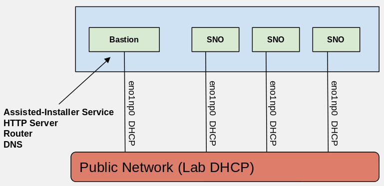

# Deploy a Single Node OpenShift cluster via jetlag quickstart

Assuming you received a scale lab allocation named `cloud99`, this guide will walk you through getting a Single Node OpenShift (SNO) cluster up in your allocation. For purposes of the guide the systems in `cloud99` will be Supermicro 1029U.

## Prerequisites

Before you start with jetlag, there are a couple of things to be installed on the machine. These instructions are also on the [README](https://github.com/redhat-performance/jetlag#prerequisites).

Good practice when you get your lab allocation is to copy your ssh pubkey to the bastion and start with jetlag from there.

## Clone Jetlag

Clone jetlag on to your laptop and change to the jetlag directory

```console
[user@fedora ~]$ git clone https://github.com/redhat-performance/jetlag.git
Cloning into 'jetlag'...
remote: Enumerating objects: 1639, done.
remote: Counting objects: 100% (393/393), done.
remote: Compressing objects: 100% (210/210), done.
remote: Total 1639 (delta 233), reused 232 (delta 160), pack-reused 1246
Receiving objects: 100% (1639/1639), 253.01 KiB | 1.07 MiB/s, done.
Resolving deltas: 100% (704/704), done.
[user@fedora ~]$ cd jetlag
```

## Review Prerequisites and set pull-secret

Review the Ansible prerequisites on the [README](https://github.com/redhat-performance/jetlag#prerequisites).

Recommended: run ansible inside virtual environment: ```source bootstrap.sh```

Set your pull secret file `pull_secret.txt` in the base directory of the cloned jetlag repo. The contents should resemble this json:

```
[user@fedora jetlag]$ cat pull_secret.txt
{
  "auths": {
    "quay.io": {
      "auth": "XXXXXXX",
      "email": "XXXXXXX"
    },
    "registry.connect.redhat.com": {
      "auth": "XXXXXXX",
      "email": "XXXXXXX"
    },
    "registry.redhat.io": {
      "auth": "XXXXXXX",
      "email": "XXXXXXX"
    }
  }
}
```

If you are deploying nightly builds then you will need a ci token and an entry for `registry.ci.openshift.org`. If you plan on deploying an ACM downstream build be sure to include an entry for `quay.io:443`

## all.yml vars file

Next copy the vars file so we can edit it.

```console
[user@fedora jetlag]$ cp ansible/vars/all.sample.yml ansible/vars/all.yml
[user@fedora jetlag]$ vi ansible/vars/all.yml
```

### Lab & cluster infrastructure vars

Change `lab` to `lab: scalelab`

Change `lab_cloud` to `lab_cloud: cloud99`

Change `cluster_type` to `cluster_type: sno`

Change `sno_node_count` to the number of SNOs that should be provisioned. For example `sno_node_count: 1`

Change `ocp_release_image` to the desired image if the default (4.14.7) is not the desired version.
If you change `ocp_release_image` to a different major version (Ex `4.14`), then change `openshift_version` accordingly.

For the ssh keys we have a chicken before the egg problem in that our bastion machine won't be defined or ensure that keys are created until after we run `create-inventory.yml` and `setup-bastion.yml` playbooks. We will revisit that a little bit later.

### Bastion node vars

The bastion node is usually the first node in an allocation.

Set `smcipmitool_url` to the location of the Supermicro SMCIPMITool binary. Since you must accept a EULA in order to download, it is suggested to download the file and place it onto a local http server, that is accessible to your laptop or deployment machine. You can then always reference that URL. Alternatively, you can download it to the `ansible/` directory of your jetlag repo clone and rename the file to `smcipmitool.tar.gz`. You can find the file [here](https://www.supermicro.com/SwDownload/SwSelect_Free.aspx?cat=IPMI).

The system type determines the values of `bastion_lab_interface` and `bastion_controlplane_interface`.

Using the chart provided by the [scale lab here](http://docs.scalelab.redhat.com/trac/scalelab/wiki/ScaleLabTipsAndTricks#RDU2ScaleLabPrivateNetworksandInterfaces), determine the names of the nic per network for EL8.

* `bastion_lab_interface` will always be set to the nic name under "Public Network"
* `bastion_controlplane_interface` should be set to the nic name under "Network 1" for this guide

You may have to ssh to your intended bastion machine and view the network interface names to ensure the correct nic name is picked here.

Here you can see a network diagram for the SNO cluster on Dell r640 with 3 SNO clusters:



For example if your bastion is ...

Dell fc640
```yaml
bastion_lab_interface: eno1
bastion_controlplane_interface: eno2
```

Dell r640
```yaml
bastion_lab_interface: eno1np0
bastion_controlplane_interface: ens1f0
```

Dell r650
```yaml
bastion_lab_interface: eno12399np0
bastion_controlplane_interface: ens1f0
```

Dell r750 (on ALIAS lab)
```yaml
bastion_lab_interface: eno8303
bastion_controlplane_interface: ens3f0
```

Supermicro 1029p or Supermicro 1029U
```yaml
bastion_lab_interface: eno1
bastion_controlplane_interface: ens2f0
```

Supermicro 5039ms
```yaml
bastion_lab_interface: enp2s0f0
bastion_controlplane_interface: enp1s0f0
```

For the guide we set our values for the Supermicro 1029u.

** If you desire to use a different network than "Network 1" for your controlplane network then you will have to append some additional overrides to the extra vars portion of the all.yml vars file.

### OCP node vars

The same chart provided by the scale lab for the bastion machine, is used to identify the nic names for `controlplane_lab_interface`.

* `controlplane_lab_interface` should always be set to the nic name under "Public Network" for the specific system type

For example if your Bare Metal OpenShift systems are ...

Dell fc640
```yaml
controlplane_lab_interface: eno1
```

Dell r640
```yaml
controlplane_lab_interface: eno1np0
```

Dell r650
```yaml
controlplane_lab_interface: eno12399np0
```

Dell r750 (on ALIAS lab)
```yaml
controlplane_lab_interface: eno8303
```

Supermicro 1029p or Supermicro 1029U
```yaml
controlplane_lab_interface: eno1
```

Supermicro 5039ms
```yaml
controlplane_lab_interface: enp2s0f0
```

For the guide we set our values for the Supermicro 1029U.

** If your machine types are not homogeneous, then you will have to manually edit your generated inventory file to correct any nic names until this is reasonably automated.

### Extra vars

No extra vars are needed for an ipv4 SNO cluster.

### Disconnected and ipv6 vars

If you want to deploy a disconnected ipv6 cluster then the following vars need to be set.

Change `setup_bastion_registry` to `setup_bastion_registry: true` and `use_bastion_registry` to `use_bastion_registry: true` under "Bastion node vars"

Append the following "override" vars in "Extra vars"

```yaml
controlplane_network: fc00:1000::/64
controlplane_network_prefix: 64
cluster_network_cidr: fd01::/48
cluster_network_host_prefix: 64
service_network_cidr: fd02::/112
fix_metal3_provisioningosdownloadurl: true
```

Oddly enough if you run into any routing issues because of duplicate address detection, determine if someone else is using subnet `fc00:1000::/64` in the same lab environment and adjust accordingly.

The completed `all.yml` vars file and generated inventory files following this section only reflect that of an ipv4 connected install. If you previously deployed ipv4 stop and remove all running podman containers off the bastion and rerun the `setup-bastion.yml` playbook.

## Review all.yml

The `ansible/vars/all.yml` now resembles ..

```yaml
---
# Sample vars file
################################################################################
# Lab & cluster infrastructure vars
################################################################################
# Which lab to be deployed into (Ex scalelab)
lab: scalelab
# Which cloud in the lab environment (Ex cloud42)
lab_cloud: cloud99

# Either bm or rwn or sno
cluster_type: sno

# Applies to both bm/rwn clusters
worker_node_count:

# Applies to sno clusters
sno_node_count: 1

# Lab Network type, applies to sno cluster_type only
# Set this variable if you want to host your SNO cluster on lab public routable
# VLAN network, set this ONLY if you have public routable VLAN enabled in your
# scalelab cloud
public_vlan: false

# Versions are controlled by this release image. If you want to change images
# you must stop and rm all assisted-installer containers on the bastion and rerun
# the setup-bastion step in order to setup your bastion's assisted-installer to
# the version you specified
ocp_release_image: quay.io/openshift-release-dev/ocp-release:4.14.7-x86_64

# This should just match the above release image version (Ex: 4.14)
openshift_version: "4.14"

# Either "OVNKubernetes" or "OpenShiftSDN" (Only for BM/RWN cluster types)
networktype: OVNKubernetes

ssh_private_key_file: ~/.ssh/id_rsa
ssh_public_key_file: ~/.ssh/id_rsa.pub
# Place your pull_secret.txt in the base directory of the cloned jetlag repo, Example:
# [user@fedora jetlag]$ ls pull_secret.txt
pull_secret: "{{ lookup('file', '../pull_secret.txt') }}"

################################################################################
# Bastion node vars
################################################################################
bastion_cluster_config_dir: /root/{{ cluster_type }}

smcipmitool_url: http://example.lab.com/tools/SMCIPMITool_2.25.0_build.210326_bundleJRE_Linux_x64.tar.gz

bastion_lab_interface: eno1
bastion_controlplane_interface: ens2f0

# vlaned interfaces are for remote worker node clusters only
bastion_vlaned_interface: ens1f1

# Sets up Gogs a self-hosted git service on the bastion
setup_bastion_gogs: false

# Set to enable and sync container images into a container image registry on the bastion
setup_bastion_registry: false

# Use in conjunction with ipv6 based clusters
use_bastion_registry: false

################################################################################
# OCP node vars
################################################################################
# Network configuration for all bm cluster and rwn control-plane nodes
controlplane_lab_interface: eno1

# Network configuration for public VLAN based sno cluster_type deployment
controlplane_pub_network_cidr:
controlplane_pub_network_gateway:
jumbo_mtu: false

# Network only for remote worker nodes
rwn_lab_interface: eno1np0
rwn_network_interface: ens1f1

################################################################################
# Extra vars
################################################################################
# Append override vars below
```

## Run playbooks

Run the create inventory playbook

```console
[user@fedora jetlag]$ ansible-playbook ansible/create-inventory.yml
...
```

The `create-inventory.yml` playbook will create an inventory file `ansible/inventory/cloud99.local` from the lab allocation data and the vars file.

The inventory file resembles ...

```
[all:vars]
allocation_node_count=6
supermicro_nodes=True

[bastion]
f12-h05-000-1029u.rdu2.scalelab.redhat.com ansible_ssh_user=root bmc_address=mgmt-f12-h05-000-1029u.rdu2.scalelab.redhat.com

[bastion:vars]
bmc_user=quads
bmc_password=xxxx

[controlplane]
# Unused

[controlplane:vars]
# Unused

[worker]
# Unused

[worker:vars]
# Unused

[remoteworker]
# Unused

[remoteworker:vars]
# Unused

[sno]
# Single Node OpenShift Clusters
f12-h06-000-1029u bmc_address=mgmt-f12-h06-000-1029u.rdu2.scalelab.redhat.com boot_iso=f12-h06-000-1029u.iso ip_address=10.1.38.222 vendor=Supermicro lab_mac=ac:1f:6b:56:57:0e network_mac=00:25:90:5f:5f:5b

[sno:vars]
bmc_user=quads
bmc_password=xxxx
dns1=10.1.36.1
dns2=10.1.36.2

[hv]
# Unused

[hv:vars]
# Unused

[hv_vm]
# Unused

[hv_vm:vars]
# Unused
```

** If your bastion machine is not running RHEL 8.6 or newer, you will have to upgrade following [this short procedure](troubleshooting.md#scalelab---upgrade-rhel).

Next run the `setup-bastion.yml` playbook ...

```console
[user@fedora jetlag]$ ansible-playbook -i ansible/inventory/cloud99.local ansible/setup-bastion.yml
...
```

We can now set the ssh vars in the `ansible/vars/all.yml` file since `setup-bastion.yml` has completed. For bare metal clusters only `ssh_public_key_file` is required to be filled out. The recommendation is to copy the public ssh key file from your bastion local to your laptop and set `ssh_public_key_file` to the location of that file. This file determines which ssh key will be automatically permitted to ssh into the cluster's nodes.

```console
[user@fedora jetlag]$ scp root@f12-h05-000-1029u.rdu2.scalelab.redhat.com:/root/.ssh/id_rsa.pub .
Warning: Permanently added 'f12-h05-000-1029u.rdu2.scalelab.redhat.com,10.1.43.101' (ECDSA) to the list of known hosts.
id_rsa.pub                                                                                100%  554    22.6KB/s   00:00
```

Then set `ssh_public_key_file: /home/user/jetlag/id_rsa.pub` or to wherever you copied the file down to.

Finally run the `sno-deploy.yml` playbook ...

```console
[user@fedora jetlag]$ ansible-playbook -i ansible/inventory/cloud99.local ansible/sno-deploy.yml
...
```

A typical deployment will require around 60-70 minutes to complete mostly depending upon how fast your systems reboot. It is suggested to monitor your first deployment to see if anything hangs on boot or if the virtual media is incorrect according to the bmc. You can monitor your deployment by opening the bastion's GUI to assisted-installer (port 8080, ex `f12-h05-000-1029u.rdu2.scalelab.redhat.com:8080`), opening the consoles via the bmc of each system, and once the machines are booted, you can directly ssh to them and tail log files.

If everything goes well you should have a cluster in about 60-70 minutes. You can interact with the cluster from the bastion. Look for the kubeconfig file under `/root/sno/...`

```console
[root@f12-h05-000-1029p ~]# export KUBECONFIG=/root/sno/<SNO's hostname>/kubeconfig
[root@f12-h05-000-1029p ~]# oc get no
...
```
